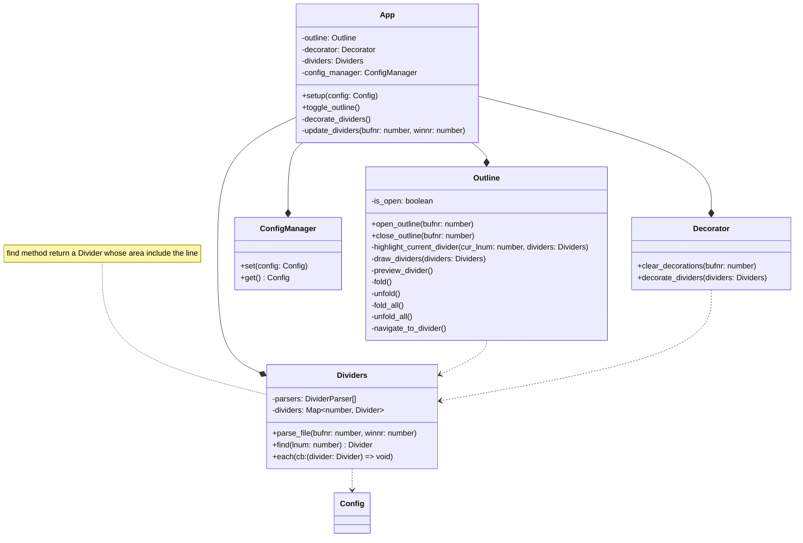

# divider.nvim

## Features

- customize rules to match dividers
  - use lua pattern
  - custom highlight
  - custom level
  - different rules for different filetypes
  - ignore some filetypes
- sign dividers
  - highlight
  - make marks
  - update on save
- list all dividers in a tree view
  - navigate to a specific divider
    - move cursor to divider
    - optionaly close tree view after navigating
  - highlight current divider
  - update on save or buffer switch
  - some dividers can be hidden
  - show line number of the divider
  - fold/unfold
    - fold all(default)
    - unfold all
    - keep fold state during updating
  - custom window position and size
  - resolve text overflow
  - custom keymap
  - preview on hover

## Architecture

### Overview

### Dividers

### Decorator

## Flow

### Get dividers

### Decorate dividers

### Update dividers

