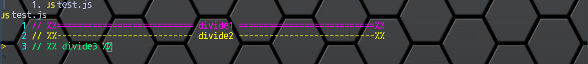
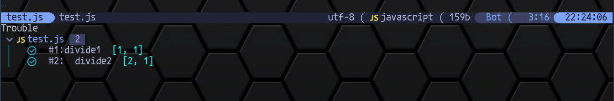

# divider.nvim

Divider line for neovim.

## Features

- highlight divider line



- list dividers in loclist and show the hierarchical relationship of dividers



- update on save

## Dependencies

- rg
- nvim-lua/plenary.nvim

## Config

- lazy.nvim

```lua
{
    "niuiic/divider.nvim",
	config = function()
		require("divider").setup({
			dividers = {
				{
                    -- divider_pattern is passed to rg command
					divider_pattern = [[%%=+ [\s\S]+ =+%%]],
                    -- content_pattern is used by lua function string.match
					content_pattern = [[%%%%=+ ([%s%S]*) =+%%%%]],
                    -- highlight color
					hl = "#ff00ff",
                    -- list = true means this divider will be stored in loclist
					list = true,
				},
				{
					divider_pattern = [[%%-+ [\s\S]+ -+%%]],
					content_pattern = [[%%%%%-+ ([%s%S]*) %-+%%%%]],
					hl = "#ffff00",
					list = true,
				},
				{
					divider_pattern = [[%% [\s\S]+ %%]],
					content_pattern = [[%%%% ([%s%S]*) %%%%]],
					hl = "#00ff7c",
					list = false,
				},
			},
		})
	end,
	dependencies = { "nvim-lua/plenary.nvim" },
}
```
