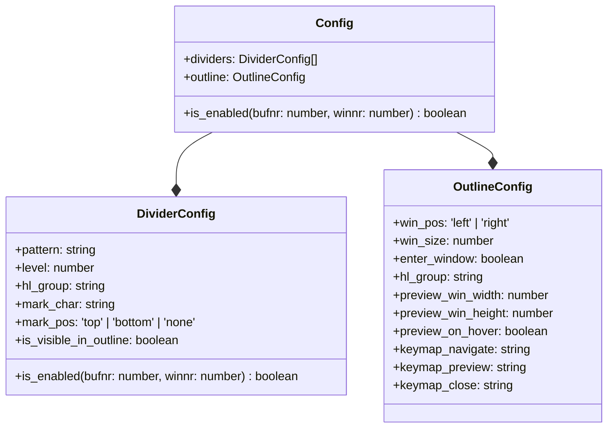

# divider.nvim

Divider line for neovim.

[More neovim plugins](https://github.com/niuiic/awesome-neovim-plugins)

## Features

- customize rules to match dividers
  - use lua pattern
  - custom highlight
  - custom level
  - different rules for different filetypes
  - ignore some buffers
- sign dividers
  - highlight
  - make marks
  - update on save
- list all dividers in a tree view
  - navigate to a specific divider
    - move cursor to divider
    - optionaly close tree view after navigating
  - highlight current divider
  - update on save or buffer switch
  - hide some dividers
  - custom window position and size
  - custom keymap
  - preview on hover


## Config

- default config

```lua
local screen_w = vim.opt.columns:get()
local screen_h = vim.opt.lines:get() - vim.opt.cmdheight:get()
local preview_win_width = math.floor(screen_w * 0.6)
local preview_win_height = math.floor(screen_h * 0.6)

local default_config = {
	is_enabled = function(bufnr)
		local ok, value = pcall(vim.api.nvim_buf_get_var, bufnr, "divider")
		return not ok or value ~= "disabled"
	end,
	dividers = {
		{
			pattern = [[ %% (.+) %%]],
			level = 1,
			hl_group = "LineNr",
			mark_char = "-",
			mark_pos = "bottom",
			is_visible_in_outline = true,
			is_enabled = function()
				return true
			end,
		},
		{
			pattern = [[ %%%% (.+) %%%%]],
			level = 2,
			hl_group = "CursorLineNr",
			mark_char = "-",
			mark_pos = "bottom",
			is_visible_in_outline = true,
			is_enabled = function()
				return true
			end,
		},
		{
			pattern = [[ %%%%%% (.+) %%%%%%]],
			level = 3,
			hl_group = "ModeMsg",
			mark_char = "-",
			mark_pos = "bottom",
			is_visible_in_outline = true,
			is_enabled = function()
				return true
			end,
		},
	},
	outline = {
		win_pos = "left",
		win_size = 30,
		enter_window = false,
		hl_group = "CursorLine",
		close_after_navigate = false,
		preview_win_width = preview_win_width,
		preview_win_height = preview_win_height,
		preview_on_hover = true,
		keymap_navigate = "<cr>",
		keymap_preview = "p",
		keymap_close = "q",
	},
}
```

- config type



## Usage

```lua
-- config
require("divider").setup(new_config)

-- open/close outline
require("divider").toggle_outline()
```
